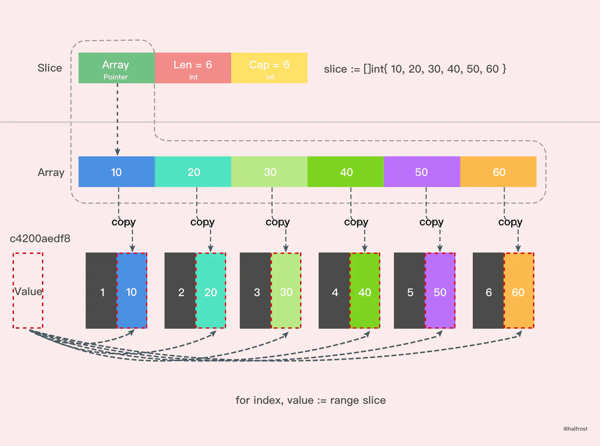

## Go 语言学习笔记

---
## 1. 常用命令

- `go build` 编译
- `go run xxx.go` 编译并运行go文件
- `go env` 查看环境变量

*打印格式：*

| 格式   | 打印内容                          |
|------|-------------------------------|
| %v   | 默认格式，自动匹配格式输出                 |
| %+v  | 打印对象时，会打印对象中的属性名称             |
| %#v  | 类似%+v，比其多打印包名和结构体名称           |
| %T   | 打印值的类型                        |
| %d   | true或false                    |
| %b   | 打印二进制格式                       |
| %c   | 字符，值对应的Unicode码值              |
| %d   | 十进制格式                         |
| %8d  | 整型长度是8，不足在值前面补空格，超出以实际为准      |
| %08d | 整型长度是8，不足在值前面补0，超出以实际为准       |
| %o   | 八进制格式                         |
| %q   | 单引号围绕的字符字面值，由Go语法安全地转义        |
| %x   | 十六进制，a-f表示                    |
| %X   | 十六进制，A-F表示                    |
| %U   | Unicode格式：U+1234，等同于 "U+%04X" |
| %s   | 输出字符串                         |
| %p   | 打印指针地址                        |

> %v,%+v,%#v打印区别
> ```bash
> # 使用%v打印一个结构体
> student is {小米 8}
> # 使用%+v打印一个结构体
> student is {Name:小米 Age:8}
> # 使用%#v打印一个结构体
> student is test1.Student{Name:"小米", Age:8}
> ```

## 2.基本类型

| 类型 | 长度(字节) | 默认值 | 说明   |
|---- |--------|-----|------|
|bool | 1      | false |
|byte | 1      | 0 |
|rune | 4      | 0 |
|int,unit| 4 or 8 | 0 | 32位 或 64位|
|int8,unit8| 1 | 0 | |
|int16,unit16| 2 | 0 | |
|int32,unit32| 4 | 0 | |
|int64| 8 | 0 | |
|float32| 4 | 0.0 | |
|float64| 8 | 0.0 | |
|complex64|8| | |
|complex128| 16 | |
|unitptr|4 or 8| |内存指针的unit32或unit64整数|
|array| | |值类型 |
|struct| | |值类型|
|string| |""|UTF-8字符串|
|slice| |nil |引用类型|
|map| |nil|引用类型|
|channel| | nil|引用类型|
|interface| |nil|引用类型|
|function| |nil|引用类型|

## 3.知识点

### 3.1下划线在import中的使用

下划线在import时，导入的包，只有init函数会被执行，其他函数无法被调用！
如下：test1/hello.go中的方法不会被调用, test1会提示undefined
```go
import (
	"fmt"
	_ "learn-go/test1" 
)

// 主入口函数
func main() {
    fmt.Println("3.主函数")
    // # command-line-arguments
    //.\main.go:11:2: undefined: test1
    test1.SayHello()
}
```

### 3.2 下划线在代码中

下划线在代码中，像是占位符，不可使用。

### 3.3 `var`关键字用来声明变量

`var`是声明变量的关键字，
格式为：`var 变量名称  类型`

### 3.4 `const`关键字用来声明常量
`const`是声明常量的关键字，声明常量时必须赋值，`iota`为常量计数器

### 3.5 强制类型转化

T(表达式)

### 3.6 数组
数组：是同一种数据类型的固定长度的序列。
- 数组定义：var a [len]int，比如：var a [5]int，数组长度必须是常量，且是类型的组成部分。一旦定义，长度不能变。
- 长度是数组类型的一部分，因此，var a[5] int和var a[10]int是不同的类型。
- 数组可以通过下标进行访问，下标是从0开始，最后一个元素下标是：len-1

```go
       for i := 0; i < len(a); i++ {
       }
       for index, v := range a {
       }
```

- 访问越界，如果下标在数组合法范围之外，则触发访问越界，会panic
- 数组是值类型，赋值和传参会复制整个数组，而不是指针。因此改变副本的值，不会改变本身的值。
- 支持 "=="、"!=" 操作符，因为内存总是被初始化过的。
- 指针数组 [n]*T，数组指针 *[n]T。

### 3.7 切片
切片：切片是数组的一个引用，因此切片是引用类型。但自身是结构体，值拷贝传递。
- 切片的长度可以改变，因此，切片是一个可变的数组。
- 切片遍历方式和数组一样，可以用len()求长度。表示可用元素数量，读写操作不能超过该限制。
- cap可以求出slice最大扩张容量，不能超出数组限制。0 <= len(slice) <= len(array)，其中array是slice引用的数组。
- 切片的定义：var 变量名 []类型，比如 var str []string  var arr []int。
- 如果 slice == nil，那么 len、cap 结果都等于 0。

### 3.8数组与切片

数组是值传递，即数组在赋值、或是方法调用时，会把数组复制一份。
```go
// 测试数组是值传递还是引用传递
func ptrArray() {
	a := [...]int{1, 2, 4}
	fmt.Printf("数组a，指针地址【%p】,数组信息：%v \n", &a, a)

	printArray(a)
}

func printArray(b [3]int) {
	fmt.Printf("数组b，指针地址【%p】,数组信息：%v \n", &b, b)
	c := b
	fmt.Printf("数组c，指针地址【%p】,数组信息：%v \n", &c, c)
}
/**
打印结果如下：
数组a，指针地址【0xc00000c150】,数组信息：[1 2 4]
数组b，指针地址【0xc00000c180】,数组信息：[1 2 4]
数组c，指针地址【0xc00000c1b0】,数组信息：[1 2 4]
 */
```
值传递导致的问题就是，数组复制占用大量内存，所以数组传递时可传递数组的地址，即数组的指针。
```go
func ptrArray() {
	a := [...]int{1, 2, 4}
	fmt.Printf("数组a，指针地址【%p】,数组信息：%v \n", &a, a)
	
	printArrayQuote(&a)
}
func printArrayQuote(b *[3]int) {
	fmt.Printf("数组b，指针地址【%p】,数组信息：%v \n", b, *b)
	c := b
	fmt.Printf("数组c，指针地址【%p】,数组信息：%v \n", c, *c)
}
/**
打印结果如下：
数组a，指针地址【0xc00000c150】,数组信息：[1 2 4]
数组b，指针地址【0xc00000c150】,数组信息：[1 2 4]
数组c，指针地址【0xc00000c150】,数组信息：[1 2 4]
 */
```

**切片扩容**
> 如果切片的容量小于 1024 个元素，扩容的时候就翻倍增加容量。
元素个数超过1024后，增长因子变成 1.25 ，即每次增加原来容量的四分之一。



